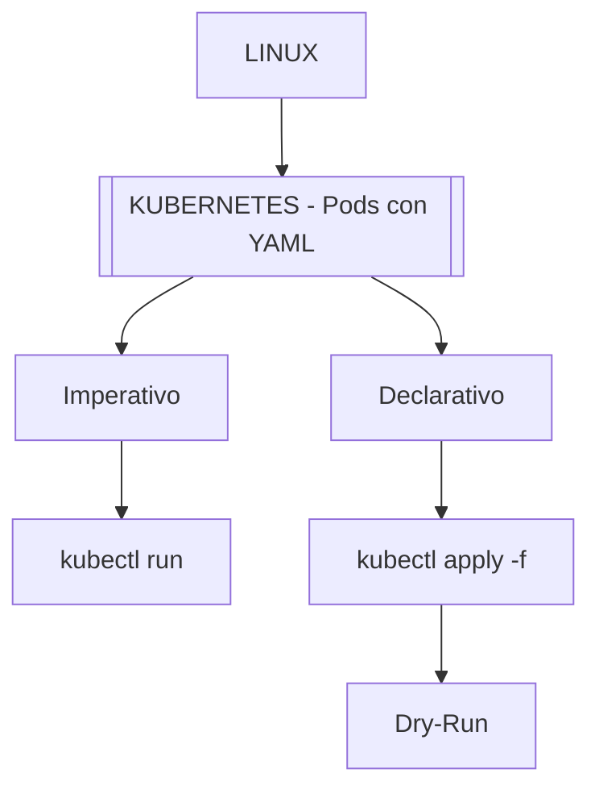

---
tags:
  - laboratorio
  - kubernetes
  - iac
  - devops
fecha_inicio: 14/04/2026
estado: completado
plataforma: KodeKloud
---

# [[LINUX]] - [[KUBERNETES - Pods con YAML]]

> [!ABSTRACT] Resumen del Laboratorio
> Laboratorio centrado en la transición del despliegue imperativo (`kubectl run`) hacia la gestión declarativa (archivos YAML), incluyendo diagnóstico de errores comunes en imágenes y ciclo de vida de Pods.

---

## 🗺️ Mapa de Conceptos (Conexiones)

---

## 🛠️ Herramientas y Comandos Críticos
| Herramienta | Uso | Flag/Sintaxis Clave |
| :--- | :--- | :--- |
| kubectl | Inspección | `get pods -o wide` |
| kubectl | Diagnóstico | `describe pod <name> | grep -i` |
| kubectl | Generación IaC | `--dry-run=client -o yaml` |
| kubectl | Aplicación | `apply -f <file.yaml>` |

---

## 📋 Puntos Clave de Aprendizaje
- **Generación Declarativa:** Uso de `--dry-run=client -o yaml` para evitar errores manuales y generar manifiestos base.
- **Diagnóstico:** Entender que `ImagePullBackOff` indica un fallo en la fase de extracción de imagen antes de que el contenedor inicie.
- **Filtrado:** Combinación eficiente de `kubectl describe` con `grep` para aislar información relevante de contenedores.
- **Estado de Recursos:** La importancia de `kubectl get events` para visualizar el historial de fallos del clúster.

---

## ⚠️ Lecciones y Troubleshooting
> [!FAILURE] Errores Comunes
> - **Error:** Fallo en la descarga de imagen (`ImagePullBackOff`).
> - **Solución:** Verificar sintaxis del nombre de la imagen y existencia en el registro.
> - **Error:** Errores de indentación en YAML.
> - **Solución:** Generar siempre el archivo base con `dry-run` en lugar de escribirlo desde cero.

> [!TIP] Lección Aprendida
> El uso de `kubectl apply` sobre recursos existentes permite que Kubernetes realice un seguimiento de los cambios mediante la anotación `last-applied-configuration`.

---

## 📌 Notas para mi Cerebro Digital
- **Mnemónicos:** DRY-RUN = "No lo hagas, solo prepáralo".
- **Anclajes:** Kubernetes YAML es la evolución lógica de los scripts de automatización en Bash.

---

## 📚 Conexiones de Conocimiento
- **Laboratorios Previos:** [[Resumen_Laboratorio_Systemd]]
- **Temas Relacionados:** [[Bash Scripting]], [[Gestión de Procesos]], [[Networking]]

---
**Estado:** Completado (13/13 ejercicios)
