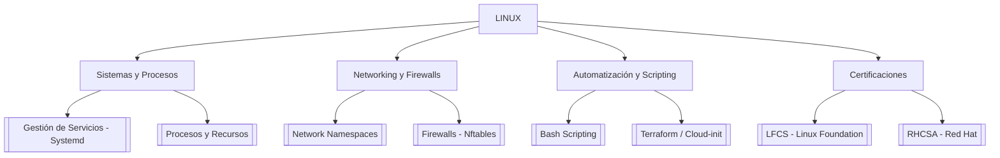

---
tags:
  - linux
  - mapa-contenido
  - index
fecha_creacion: 2026-04-27
estado: en_desarrollo
---

# [[LINUX]] - Mapa de Conocimiento (MOC)

> [!ABSTRACT] Mapa Principal
> Este es el nodo central de mi cerebro virtual dedicado a Linux. Aquí se consolidan mis estudios, laboratorios prácticos, certificaciones y proyectos de automatización.

---

## 🗺️ Estructura del Conocimiento

---

## 🏗️ Áreas de Trabajo

### 1. Sistema y Automatización
- [[Resumen_Laboratorio_Systemd]] - *Completado*

### 2. Networking y Firewall
- (En desarrollo...)

### 3. Certificaciones
- (En desarrollo...)

---

## 📝 Notas para mi Cerebro Digital
> [!TIP] Filosofía
> Linux no se aprende de memoria, se entiende a través de la práctica y el troubleshooting constante. Este MOC es un ser vivo que evoluciona con cada lab.

---

## 📚 Conexiones de Conocimiento
- **Laboratorios Recientes:** [[Resumen_Laboratorio_Systemd]]
- **Configuración Global:** [[Configuración de Entorno]]

---
**Actualizado:** 2026-04-27
