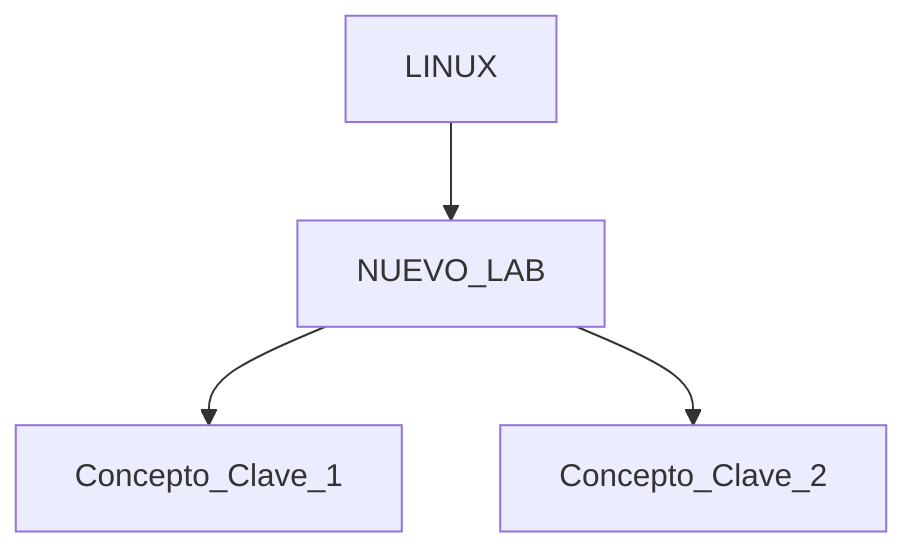

---
tags:
  - laboratorio
  - linux
  - infraestructura
  - sysadmin
fecha_inicio: 2026-04-27
estado: en_progreso
plataforma: 
---

# [[LINUX]] - [NOMBRE DEL LABORATORIO]

> [!ABSTRACT] Resumen del Laboratorio
> [Breve descripción de qué se trata este laboratorio y su objetivo principal.]

---

## 🗺️ Mapa de Conceptos (Conexiones)

---

## 🛠️ Herramientas y Comandos Críticos
| Herramienta | Uso | Flag/Sintaxis Clave |
| :--- | :--- | :--- |
| | | |

---

## 📋 Puntos Clave de Aprendizaje
- **[Concepto 1]:** 
- **[Concepto 2]:** 

---

## ⚠️ Lecciones y Troubleshooting
> [!FAILURE] Errores Comunes
> - **Error:** 
> - **Solución:** 

> [!TIP] Lección Aprendida
> 

---

## 📌 Notas para mi Cerebro Digital
- **Mnemónicos:** 
- **Anclajes:** 

---

## 📚 Conexiones de Conocimiento
- **Laboratorios Previos:** [[LINUX -]]
- **Temas Relacionados:** [[Bash Scripting]], [[Gestión de Procesos]], [[Networking]]

---
**Estado:** Completado (X/Y ejercicios)
