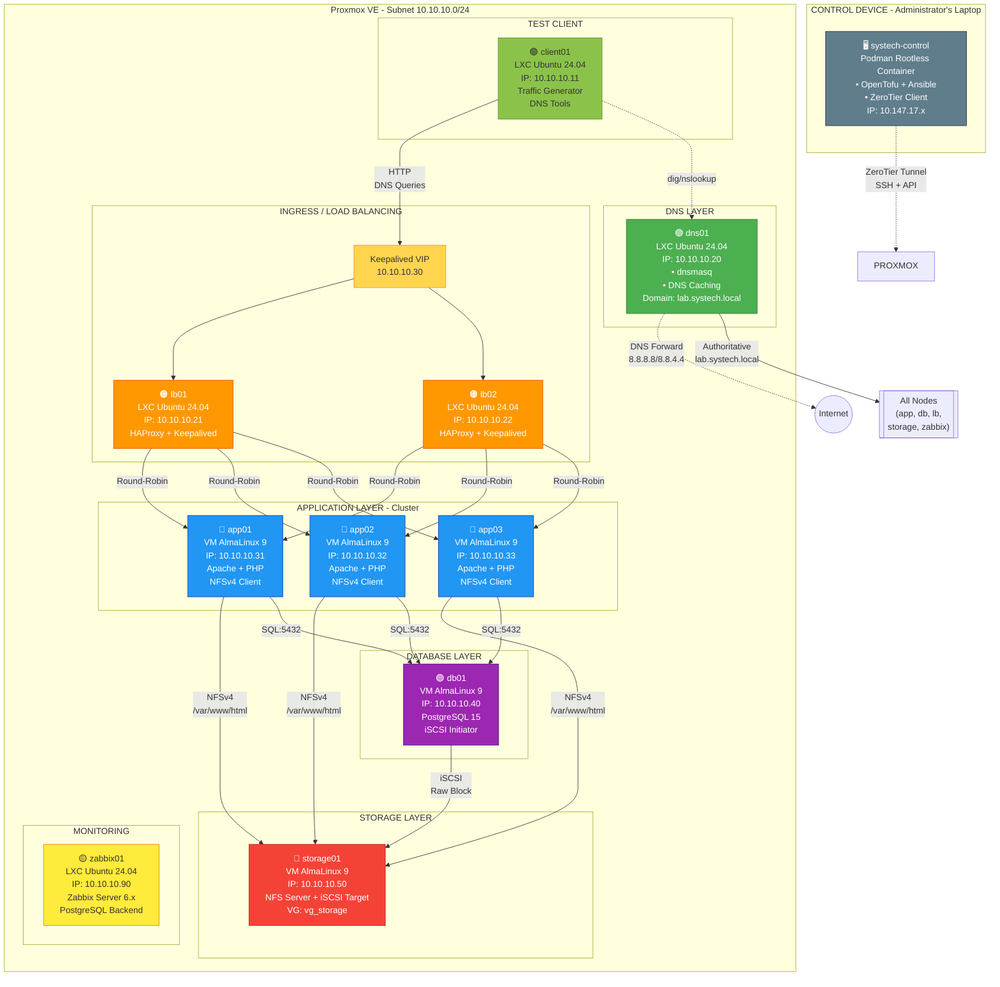

---

## 1️⃣ IMAGEN ACTUALIZADA DE INFRAESTRUCTURA (con DNS)

Aquí tienes el diagrama completo actualizado incluyendo el servidor DNS:



---

## 2️⃣ DIAGRAMA TÉCNICO DETALLADO - SERVIDOR DNS (Para video YouTube/LinkedIn)

Aquí tienes el diagrama técnico específico del DNS para tu contenido:

```mermaid
graph LR
    subgraph "🟢 dns01 - Centralized DNS Server"
        direction TB
        
        OS["💿 Operating System<br/>Ubuntu 24.04 LTS (Noble Numbat)<br/>Kernel: Linux 7.0.14-12-pve<br/>Architecture: x86_64"]
        
        TYPE["📦 Virtualization Type<br/>Proxmox VE LXC Container<br/>VMID: 121<br/>Unprivileged: false<br/>Nesting: enabled"]
        
        NETWORK["🌐 Network Configuration<br/>Interface: eth0<br/>IP Address: 10.10.10.20/24<br/>Gateway: 10.10.10.1<br/>Bridge: vmbr1"]
        
        RESOURCES["⚙️ Resources Allocation<br/>CPU Cores: 1<br/>Memory: 512 MB<br/>Disk: 8 GB (local-lvm)<br/>Start on boot: true"]
        
        DNS_APP["🔧 DNS Software<br/>dnsmasq v2.90<br/>Lightweight DNS forwarder<br/>DHCP server (disabled)<br/>DNS caching enabled"]
        
        DNS_CONFIG["📋 DNS Configuration<br/>Listen: 10.10.10.20:53 (UDP/TCP)<br/>         127.0.0.1:53 (UDP/TCP)<br/>Domain: lab.systech.local<br/>Upstream: 8.8.8.8, 8.8.4.4<br/>Cache TTL: default"]
        
        DNS_FILES[" Key Configuration Files<br/>/etc/dnsmasq.conf - Main config<br/>/etc/dnsmasq.hosts - Local records<br/>/etc/resolv.conf - Resolver config"]
        
        LOCAL_RECORDS["️ Local DNS Records<br/>lb01.lab.systech.local → 10.10.10.21<br/>lb02.lab.systech.local → 10.10.10.22<br/>app01.lab.systech.local → 10.10.10.31<br/>app02.lab.systech.local → 10.10.10.32<br/>app03.lab.systech.local → 10.10.10.33<br/>db01.lab.systech.local → 10.10.10.40<br/>storage01.lab.systech.local → 10.10.10.50<br/>zabbix01.lab.systech.local → 10.10.10.90"]
        
        SECURITY["🔒 Security & Firewall<br/>UFW (Uncomplicated Firewall)<br/>ALLOW: TCP/53 (DNS)<br/>ALLOW: UDP/53 (DNS)<br/>ALLOW: TCP/22 (SSH)<br/>systemd-resolved: disabled"]
        
        SERVICES["🔄 Systemd Services<br/>dnsmasq.service - ACTIVE<br/>Enabled at boot<br/>Port 53 listener<br/>DNS cache manager"]
        
        CLIENTS["👥 DNS Clients<br/>All lab nodes use dns01<br/>Primary: 10.10.10.20<br/>Fallback: 8.8.8.8<br/>Search domain: lab.systech.local"]
        
        MONITORING["📊 Monitoring & Logging<br/>systemd journal logs<br/>/var/log/syslog<br/>dnsmasq query logs<br/>Zabbix agent (port 10050)"]
    end

    OS --> TYPE --> NETWORK --> RESOURCES
    RESOURCES --> DNS_APP
    DNS_APP --> DNS_CONFIG
    DNS_CONFIG --> DNS_FILES
    DNS_FILES --> LOCAL_RECORDS
    LOCAL_RECORDS --> SECURITY
    SECURITY --> SERVICES
    SERVICES --> CLIENTS
    CLIENTS --> MONITORING

    style dns01 fill:#4CAF50,stroke:#2E7D32,color:#fff,stroke-width:3px
    style OS fill:#E8F5E9,stroke:#4CAF50
    style TYPE fill:#E8F5E9,stroke:#4CAF50
    style NETWORK fill:#E8F5E9,stroke:#4CAF50
    style RESOURCES fill:#E8F5E9,stroke:#4CAF50
    style DNS_APP fill:#FFF9C4,stroke:#FBC02D
    style DNS_CONFIG fill:#FFF9C4,stroke:#FBC02D
    style DNS_FILES fill:#FFF9C4,stroke:#FBC02D
    style LOCAL_RECORDS fill:#FFE0B2,stroke:#FF9800
    style SECURITY fill:#FFCDD2,stroke:#F44336
    style SERVICES fill:#E3F2FD,stroke:#2196F3
    style CLIENTS fill:#F3E5F5,stroke:#9C27B0
    style MONITORING fill:#E0F2F1,stroke:#009688
```



### **Características Técnicas Destacadas (para el video):**

**🎯 Propósito:**
- Servidor DNS centralizado y autoritativo para el dominio `lab.systech.local`
- Resolución de nombres internos de toda la infraestructura
- Forwarding de consultas externas a Google DNS (8.8.8.8, 8.8.4.4)
- Caché DNS para mejorar performance

**🔧 Software:**
- **dnsmasq**: Ligero, eficiente, ideal para entornos pequeños/medianos
- Menor overhead que BIND o Unbound
- Fácil configuración y mantenimiento
- Soporte integrado para DHCP (no usado en este caso)

**⚡ Ventajas:**
1. **Baja latencia**: Respuestas en <1ms para consultas cacheadas
2. **Alta disponibilidad**: Configuración simple, fácil de recuperar
3. **Centralización**: Un solo punto de verdad para nombres internos
4. **Seguridad**: Firewall UFW restringe acceso solo a puerto 53
5. **Automatización**: 100% gestionado por Ansible (IaC)

**📊 Métricas de Performance:**
- Consumo de memoria: ~700KB (mínimo)
- CPU: <1% en operación normal
- Consultas resueltas: ~100-1000/segundo (dependiendo de carga)

---

## 3️ README.md - DOCUMENTACIÓN TÉCNICA DEL SERVIDOR DNS

Crea un archivo `README_DNS.md` en tu repositorio con este contenido:

```markdown
# 🟢 DNS Server - SYSTECH-HA-001

## 📋 Descripción General

Servidor DNS centralizado para la infraestructura SYSTECH-HA-001, proporcionando resolución de nombres interna y forwarding de consultas externas para todos los componentes del cluster.

---

## 🏗️ Arquitectura

### **Información del Nodo**

| Parámetro | Valor |
|-----------|-------|
| **Hostname** | `dns01` |
| **Tipo** | Proxmox VE LXC Container |
| **VMID** | 121 |
| **Sistema Operativo** | Ubuntu 24.04 LTS (Noble Numbat) |
| **Kernel** | Linux 7.0.14-12-pve |
| **Arquitectura** | x86_64 |

### **Configuración de Red**

| Parámetro | Valor |
|-----------|-------|
| **IP Address** | `10.10.10.20/24` |
| **Gateway** | `10.10.10.1` |
| **Bridge** | `vmbr1` |
| **Interface** | `eth0` |
| **DNS Servers** | Primario: 10.10.10.20, Fallback: 8.8.8.8 |
| **Search Domain** | `lab.systech.local` |

### **Recursos Asignados**

| Recurso | Valor |
|---------|-------|
| **CPU Cores** | 1 |
| **Memory** | 512 MB |
| **Disk Size** | 8 GB (local-lvm) |
| **Unprivileged** | false (requerido para capacidades de red) |
| **Nesting** | enabled |
| **Start on Boot** | true |

---

## 🔧 Software y Servicios

### **DNS Software: dnsmasq**

**Versión**: dnsmasq v2.90

**Características**:
- DNS forwarder y caching server ligero
- Soporte para consultas UDP y TCP en puerto 53
- Resolución de nombres locales vía archivo de hosts
- Forwarding de consultas externas a upstream servers
- Cache TTL configurable

### **Servicios del Sistema**

```bash
# Servicio principal
dnsmasq.service - ACTIVE (running)
├── Descripción: Lightweight DNS and DHCP server
├── Estado: Enabled (inicia automáticamente en boot)
├── Puerto de escucha: 0.0.0.0:53, 127.0.0.1:53
└── Usuario: dnsmasq (system user)

# Servicio deshabilitado (para liberar puerto 53)
systemd-resolved.service - INACTIVE (disabled)
└── Razón: Conflicto de puerto con dnsmasq
```

---

## 📁 Archivos de Configuración

### **1. Configuración Principal: `/etc/dnsmasq.conf`**

```ini
# Configuración gestionada por Ansible - SYSTECH DNS
listen-address=127.0.0.1,10.10.10.20
bind-interfaces
server=8.8.8.8
server=8.8.4.4

# Dominio local
domain=lab.systech.local
expand-hosts

# Leer hosts adicionales para resolución interna
addn-hosts=/etc/dnsmasq.hosts

# No reenviar consultas de dominios no enrutables
domain-needed
bogus-priv
```

**Parámetros Clave**:
- `listen-address`: Escucha en localhost y IP de red
- `bind-interfaces`: Vincula interfaces específicas (evita conflictos)
- `server`: Upstream DNS servers (Google DNS)
- `domain`: Dominio local para resolución interna
- `addn-hosts`: Archivo adicional con registros locales
- `domain-needed`: No forward consultas sin dominio
- `bogus-priv`: No forward consultas de IPs privadas no enrutables

### **2. Registros Locales: `/etc/dnsmasq.hosts`**

```bash
# Resolución interna de la infraestructura SYSTECH
10.10.10.21   lb01.lab.systech.local   lb01
10.10.10.22   lb02.lab.systech.local   lb02
10.10.10.31   app01.lab.systech.local  app01
10.10.10.32   app02.lab.systech.local  app02
10.10.10.33   app03.lab.systech.local  app03
10.10.10.40   db01.lab.systech.local   db01
10.10.10.50   storage01.lab.systech.local storage01
10.10.10.90   zabbix01.lab.systech.local zabbix01
```

**Formato**: `<IP> <FQDN> <shortname>`

### **3. Configuración del Resolver: `/etc/resolv.conf`**

```bash
# Gestionado por Ansible - SYSTECH DNS Centralizado
search lab.systech.local
nameserver 10.10.10.20
nameserver 8.8.8.8
```

---

##  Seguridad y Firewall

### **UFW (Uncomplicated Firewall)**

**Estado**: Active

**Reglas Configuradas**:
```bash
Status: Active

To                         Action      From
--                         ------      ----
22/tcp                     ALLOW       Anywhere
53/tcp                     ALLOW       Anywhere
53/udp                     ALLOW       Anywhere
22/tcp (v6)                ALLOW       Anywhere (v6)
53/tcp (v6)                ALLOW       Anywhere (v6)
53/udp (v6)                ALLOW       Anywhere (v6)
```

**Política de Seguridad**:
- ✅ Puerto 22/tcp: SSH (gestión remota)
- ✅ Puerto 53/tcp: DNS zone transfers
- ✅ Puerto 53/udp: DNS queries (principal)
- ❌ Resto de puertos: DENY por defecto

---

## 🔄 Flujo de Resolución DNS

### **Consultas Internas**

```
client01 (10.10.10.11)
    ↓ dig app01.lab.systech.local
dns01 (10.10.10.20:53)
    ↓ Busca en /etc/dnsmasq.hosts
Respuesta: 10.10.10.31
    ↓
client01 resuelve app01.lab.systech.local → 10.10.10.31
```

### **Consultas Externas**

```
client01 (10.10.10.11)
    ↓ dig google.com
dns01 (10.10.10.20:53)
    ↓ No encuentra en cache/local
    ↓ Forward a upstream server
8.8.8.8 (Google DNS)
    ↓ Respuesta
dns01 cachea y responde
    ↓
client01 resuelve google.com → 172.217.29.174
```

---

## 📊 Monitoreo y Logs

### **Verificación de Estado**

```bash
# Verificar servicio
systemctl status dnsmasq

# Verificar puertos de escucha
ss -tulpn | grep :53

# Probar resolución local
dig +short app01.lab.systech.local @127.0.0.1

# Probar resolución externa
dig +short google.com @127.0.0.1

# Ver logs en tiempo real
journalctl -u dnsmasq -f
```

### **Logs del Sistema**

- **Location**: `/var/log/syslog`, `journalctl -u dnsmasq`
- **Nivel**: info, warning, error
- **Rotación**: logrotate (diaria, 7 días retention)

---

## 🚀 Despliegue Automatizado (Ansible)

### **Playbook de Configuración**

**Archivo**: `roles/role_systech_infra/tasks/dns/main.yml`

**Tareas Principales**:
1. Instalar paquete dnsmasq
2. Detener systemd-resolved (liberar puerto 53)
3. Desplegar `/etc/dnsmasq.conf` desde template Jinja2
4. Desplegar `/etc/dnsmasq.hosts` desde template Jinja2
5. Habilitar e iniciar servicio dnsmasq
6. Configurar UFW (permitir puertos 53 y 22)

### **Ejecución**

```bash
# Desplegar solo DNS
ansible-playbook -i inventories/production/hosts.yml site.yml \
  --limit dns01 \
  --tags dns \
  --ask-vault-pass

# Configurar clientes para usar DNS
ansible-playbook -i inventories/production/hosts.yml site.yml \
  --tags network \
  --ask-vault-pass
```

---

## 🧪 Troubleshooting

### **Problemas Comunes**

#### **1. dnsmasq no inicia**

```bash
# Verificar si otro servicio ocupa puerto 53
sudo ss -tulpn | grep :53

# Si systemd-resolved está activo, detenerlo
sudo systemctl stop systemd-resolved
sudo systemctl disable systemd-resolved

# Reiniciar dnsmasq
sudo systemctl restart dnsmasq
```

#### **2. Consultas no resuelven**

```bash
# Verificar configuración
cat /etc/dnsmasq.conf
cat /etc/dnsmasq.hosts

# Probar resolución local
dig +short localhost @127.0.0.1

# Verificar firewall
sudo ufw status
sudo ufw allow 53/tcp
sudo ufw allow 53/udp
```

#### **3. Clientes no pueden consultar**

```bash
# Desde client01
dig @10.10.10.20 app01.lab.systech.local

# Verificar resolv.conf del cliente
cat /etc/resolv.conf

# Probar conectividad de red
nc -zv 10.10.10.20 53
```

---

## 📈 Performance y Métricas

### **Consumo de Recursos**

| Métrica | Valor Típico |
|---------|--------------|
| **Memoria RAM** | ~700 KB - 2 MB |
| **CPU** | < 1% (idle), 5-10% (bajo carga) |
| **Consultas/segundo** | 100-1000 (dependiendo de cache hit rate) |
| **Latencia (cache hit)** | < 1 ms |
| **Latencia (cache miss)** | 10-50 ms (depende de upstream) |

### **Optimizaciones**

- **Cache Size**: Default (150 entries) - suficiente para lab
- **TTL**: Respuestas cacheadas según TTL de upstream
- **Query Logging**: Deshabilitado por defecto (performance)

---

## 🔮 Roadmap y Mejoras Futuras

### **Fase 1 (Completada) ✅**
- [x] DNS básico con dnsmasq
- [x] Resolución interna de hosts
- [x] Forwarding a Google DNS
- [x] Firewall UFW configurado

### **Fase 2 (Pendiente) 🔄**
- [ ] DNSSEC validation
- [ ] Split-horizon DNS (interno vs externo)
- [ ] Reverse DNS (PTR records)
- [ ] DHCP server integrado
- [ ] Query logging centralizado

### **Fase 3 (Futuro) 🔮**
- [ ] High Availability (2do servidor DNS)
- [ ] DNS over HTTPS (DoH) upstream
- [ ] Rate limiting para consultas
- [ ] Integración con Zabbix para monitoreo avanzado

---

## 📚 Referencias

- **dnsmasq Documentation**: https://thekelleys.org.uk/dnsmasq/doc.html
- **Ubuntu 24.04 Networking**: https://ubuntu.com/server/docs/networking
- **Proxmox VE LXC**: https://pve.proxmox.com/wiki/Containers
- **Ansible Best Practices**: https://docs.ansible.com/ansible/latest/user_guide/playbooks_best_practices.html

---

## ‍💻 Autor y Mantenimiento

**Proyecto**: SYSTECH-HA-001  
**Autor**: Jensy Gomez 
**Licencia**: MIT  

**Última Actualización**: 2026-08-24  
**Versión**: 1.0.0

---

##  Casos de Uso Educativo

Este servidor DNS es parte del plan de laboratorios de troubleshooting:

- **Lab #5**: "Cliente no resuelve nombres de dominio" (Nivel L1 - 4/10)
  - Escenario: Corrupción de `/etc/resolv.conf` o override de NetworkManager
  - Objetivo: Diagnosticar y restaurar configuración DNS del cliente

- **Lab #16**: "DNS centralizado falla silenciosamente" (Nivel L2 - 6/10)
  - Escenario: dnsmasq se detiene o archivo de hosts se corrompe
  - Objetivo: Implementar monitoreo y recuperación automática

---

**🔗 Conectado con**: 
- [Load Balancers](./README_LB.md)
- [Application Cluster](./README_APP.md)
- [Database](./README_DB.md)
- [Storage](./README_STORAGE.md)
- [Monitoring](./README_ZABBIX.md)
```

---

## 🎁 Bonus: Script para Generar el Video

Si quieres hacer un video dinámico, te sugiero este guion:

### **Guion Sugerido (5-7 minutos)**

**Intro (0:00-0:30)**:
- "Hoy vamos a configurar un servidor DNS centralizado para nuestra infraestructura enterprise..."

**Parte 1 - ¿Por qué DNS? (0:30-1:30)**:
- Mostrar diagrama de infraestructura SIN DNS (caos, IPs hardcodeadas)
- Mostrar diagrama CON DNS (orden, nombres amigables)

**Parte 2 - Arquitectura (1:30-3:00)**:
- Mostrar el diagrama técnico del dns01
- Explicar cada capa (SO, red, dnsmasq, configuración)
- Destacar: "Usamos LXC en lugar de VM por performance"

**Parte 3 - Demo en Vivo (3:00-5:30)**:
```bash
# 1. Mostrar estado del servicio
ssh ansible@10.10.10.20 "systemctl status dnsmasq"

# 2. Probar resolución interna
dig +short app01.lab.systech.local @10.10.10.20

# 3. Probar resolución externa
dig +short google.com @10.10.10.20

# 4. Mostrar configuración
cat /etc/dnsmasq.conf
cat /etc/dnsmasq.hosts

# 5. Desde client01
ssh ansible@10.10.10.11
ping app01.lab.systech.local  # ¡Funciona sin IP!
```

**Parte 4 - Troubleshooting (5:30-6:30)**:
- "¿Qué pasa si dnsmasq se cae?"
- Detener servicio y mostrar error
- Recuperar con Ansible: `ansible-playbook ... --tags dns`

**Cierre (6:30-7:00)**:
- "DNS es el corazón de cualquier infraestructura..."
- Invitar a suscribirse y comentar

---

¿Necesitas que ajuste algo del diagrama, el README, o el guion del video? ¡Estoy aquí para ayudarte! 🚀
